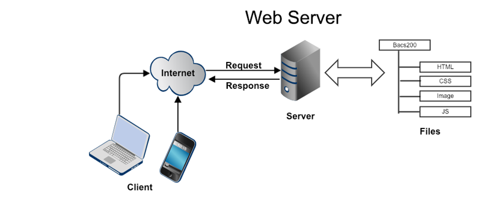
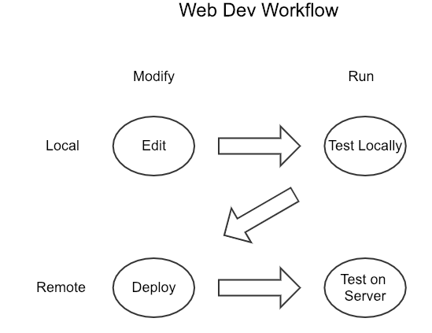
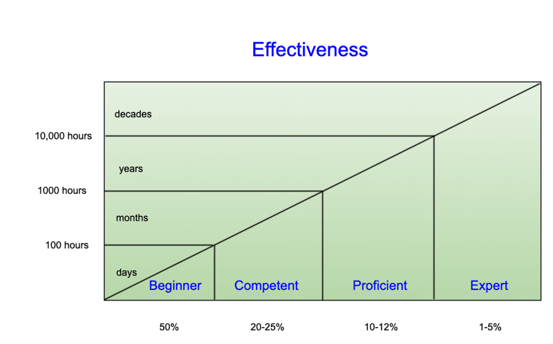

---
title:
- type: main
  text: Building Python Web Apps
- type: subtitle
  text: A Classroom-tested approach with 14 Projects and 42 Design Patterns
creator:
- role: author
  text: Mark D. Seaman
rights: © Copyright 2022 - All rights reserved.
  \n\n
  No portion of this book may be reproduced in any form without written permission from the author, 
  except as permitted by U.S. copyright law.”
cover-image: img/PythonWebApps.jpg
---
# Introduction

Teaching programming skills presents some unique challenges. Reading a book and listening to
lectures can't teach you the necessary skills to be a proficient programmer. You learn to code by
putting your hands on the keyboard and doing it. After working for 25 years as a software engineer
and a software process architect at HP, I owned a custom software engineering company for 12 years,
and then 5 years ago began teaching web development as an Adjunct Professor at the University of
Northern Colorado. I understand what it takes to succeed right out of college, and I have a passion
for preparing students for their first job.

This textbook is the result of 5 years of fine-tuning my approach to teaching web development. I was
dismayed by the first textbooks I reviewed. They were heavy on memorizing terms and abstract
concepts and very light on actual programming assignments. I have practiced the disciplines of
Agile Software development since its earliest days, and I've applied that same mindset to
teaching.

The fastest way to learn coding is to write code, see it fail, and learn how to fix it. This
textbook presents the basic concepts of web development with Python in 14 chapters that easily map
onto a 15-week semester. Each chapter has a discussion of the key concept, discrete skills, and
demo code, and culminates with a project.

The quickest way to learn programming skills is to immediately start programming. Every task is
difficult the first time, but you quickly learn with practice. With each victory, there is new
knowledge that is retained for the next time you see a similar situation. You must form new neural
pathways in your brain, and these are formed as you use creativity to solve problems. By the end of
this book, you will have enough experience to build apps commercially using the skills you have
gained.

### Who is this Book For?

This textbook will teach you how to build web applications efficiently. It does not assume any
programming experience beyond the ability to read Python code. If you can read Python, then you can
learn to write it by studying the example code in each chapter.

During this course, you will learn everything you need to know about the tools and techniques that
are needed to build and deploy a commercial web application. We will start by installing
development tools and creating projects using a powerful web framework (Django) and deploying these
to a web hosting service.

### Learning Progression

There are about 50 skills that are required to build an application. Each of the 14 chapters
introduces new skills. Each project is based on learning these skills. Each time you apply a skill
it gets easier. Each project is scoped to require and verify the learning as you go.

The skills learned for one project will carry forward to all the later projects. This builds
automatic responses and reinforces the learning. By the end of the course, you will have lots of
practice in doing the routine tasks that you learned early on. These activities will be automatic
and will require very little conscious thought.

Each project builds on the previous ones. All 14 projects will work together to produce a
medium-sized commercial web application.

**App Features:**

-   Built on the latest free development tools
-   Hosted on the free commercial web hosting server
-   Database to store info
-   User administration
-   Views to present data
-   Editing via forms
-   CRUD operations for all data models
-   Automatic tests
-   Styling with Bootstrap
-   Reusable data widgets
-   Refactoring and design patterns
-   Image upload
-   Data import/export
-   Engineering practices
-   Internet Resources

### College Class vs. Personal Learning

This course requires about 100 hours of concentrated effort and focused practice. Investing that
amount of energy will enable you to build apps on your own successfully. Additional time is
required to get quicker at the skills and get stuck less often, but this course will prepare you to
write commercial apps professionally.

This textbook is also ideal for personal learning outside the classroom. Anyone that invests 100
hours will learn the skills to build a modern web app. This could be used for On-The-Job Training
or professional development.

The internet is full of excellent free resources to help you in specific situations. There are links
throughout this textbook for additional learning content.

### Pair Programming

I recommend that you team up with someone else to learn this together. Learning goes faster with a
buddy. It gives you someone to discuss confusing issues with and someone to help you when you get
stuck.

In the real world, pair programming is common. Two people write one chunk of code and discuss it as
they go. Bugs get squashed before they make it into the code and the peer pressure naturally
increases the quality and quantity of the work.

# Chapter 1 - Development Tools

-   Skill 1 - Install Python & Django
-   Skill 2 - Github & VS Code
-   Skill 3 - Create Django App
-   Project 1 - Setup Development Tools

### Web Servers and Clients

This book will teach you how to build web applications that will run on a phone, tablet, laptop, or
desktop computer. This same app will adjust the display size according to the device being used.
The layout of all the views will change to match the device. This is called Responsive Web Design.

Web apps are the primary way that people interact with servers today. The devices that users
interact with (mobile, laptops, or desktops) are called clients, while the remote computers are
called servers. This Client/Server architecture is fundamental to the internet.

The internet is a gigantic network that allows servers to be accessed from anywhere in the world.
Commercial routers provide addressing to get to a specific machine from a client device. An URL
(Uniform Resource Locator) is an address of a specific machine page or resource on some machine on
the internet.

A web server is software that runs on a remote computer that responds to a request for an URL and
generates a response that is sent back to the client. The client makes a request and the server
sends a response. The client software then displays the response to the user. A web browser is the
software that displays the responses to the user and allows users to make web requests.

### Building Web Apps

There are two types of web servers on the internet. Some servers simply return files for a request.
These files might be HTML, JavaScript, images, or other asset types, but they are always static.
These servers are called static web servers since they only respond with static information.

On the other hand, dynamic web servers are far more interesting. They receive web requests and may
do complex calculations and store data in a database. For each request, the server must create an
appropriate response and may need to invoke other computers in the process.

Static web servers are useful but are quite limited in their capability. Dynamic servers allow the
programmer to perform any kind of work necessary to create the desired function. Building a web
application requires a dynamic server that executes code to generate the response, usually working
with a database.

The pages are generated by code written in a general programming language such as Python,
JavaScript, C#, or Java.

### Common Components of Web Apps

I've been building web pages and applications since the beginning of the internet and have written
over fifty complete applications. I have commercial experience with all of the most common
languages and frameworks for creating web apps. Most web apps have several common components.

-   Mobile device app
-   Front-end (user experience)
-   Business logic
-   Database

### Front-end/Back-end

Web development has gotten surprisingly sophisticated and complex. When browser software first began
to execute JavaScript code there was a fundamental shift of software logic from the server to the
client. Web pages were no longer simple static assets that were displayed by the browser. Now
complex code logic was sent from the server to be executed in the client browser.

Eventually, this took on the name of Front-end Development. Powerful JavaScript frameworks were
increasingly used to create a dynamic user experience that runs on the client side of the
internet.

Back-end Development focuses on the code logic that runs on the server. This usually revolves around
the database and may include a web service API to communicate with other computers. The back-end
software is typically built using a framework that performs all of the common tasks.

Full-stack Development involves both the front-end and the back-end. Sometimes these are separated
out into different responsibilities. Modern web development is not based on a single tool but
rather a stack of interdependent tools. A Full-stack Developer must be fluent across the full range
of languages and frameworks.

The first decision to be made on a project is what tool stack to use.

### Tool Stack
In this textbook, we will be using the following tools for back-end development (server-side code)

-   Virtual Studio Code - Development Environment
-   Django - Web Development Framework
-   Python - Programming Language
-   MySQL - Database

### Web Frameworks

There are many reasons to use a web framework. It provides reusable code that enables you to quickly
build an app. This code solves all the common problems. We leverage tens of thousands of hours of
effort. This reduces the amount of code you need to write to only 10% of the code needed for an
application.

Other Frameworks and Languages

-   .Net - C#
-   Rails - Ruby
-   Laravel - PHP
-   Django - Python

### Development Tools

There is a wide variety of great tools available to work with Django applications. For this textbook, I have selected tools that balance ease of learning with robust power. This gives you a quick
start but also enables you to scale your efforts as needed.

There are several tools in our development stack, from low-level and moving to higher levels.

-   Git - version control system
-   Github - web service to manage Git repositories
-   Microsoft Visual Studio Code - integrated development environment
-   Python with Django - environment for building web apps

Each of these tools must be installed and set up in order to provide a powerful platform on which to
build our application code. There are many other tools that could be used, but these tools are
proven to get you up and running with the least amount of work.

### Django Projects

Django is a web development framework that contributes all of the generic code logic for your
applications. You will create a Django project that will be deployed on an application service
(such as AWS, Google App Engine, or Digital Ocean). You will use the features in the Django
Framework to accelerate the build of your custom application.
During development, you will build reusable logic specific to your application. Django provides an
easy way to reuse code in other projects by encapsulating them as modules called "Apps". A Django
project is built from one or more apps. The reuse of the \"app\" name is somewhat unfortunate and
causes some confusion for learning Django initially.

Just remember a Django Project (Application) is built from multiple Apps(Django component modules).
We will spend a lot of time working with this and it will become obvious very quickly.

### Setting Up Development Tools

Before we build an application using Django we need to set up an environment that will support our
code development. There are several different tools that need to be configured. These are presented
as specific skills with step-by-step instructions. Go through these one at a time. Do not go on to
the next one until you are sure that you have it right.

-   Visual Studio
-   Github
-   Python Environment
-   Development Server

### Code Sharing

Programming projects typically start with existing code from someone else. By cloning a repo you can
get a copy of the code to work with on your local computer. Your changes are mixed in with the
other changes that occur on the repo that you cloned. To get these changes you do a
"git pull".

To share the changes you make with others you do a "git push" command. This merges your recently
committed changes back to the repo that you cloned from. You are only permitted to do this if you
have permissions to the remote repository.

If you are starting with someone else's code then you need to "Fork" the repository. This creates
a new repository that you own. You can push new changes to your repository without affecting the
one that you forked from. New changes to the upstream repo can be pulled to keep your forked repo
updated.

I have created a repo at
"https://github.com/Mark-Seaman/PythonWebApps". You will fork this repo to
  create "https://github.com/your-name/PythonWebApps". You will clone this repo on your local
  computer and use "git pull" and "git push" to sync your changes.

Skill #2 gives you step-by-step instructions for how to set up your repositories at Github and on
your local computer.

# Chapter 2 - Application Hosting

* Skill 4 - Deploy a Static Web Server
* Skill 5 - Development Server
* Skill 6 - Production Server
* Project - Hosted Application

### Web Hosting Technology

Running a web application on the internet requires many layers of software and
hardware. All of these layers must be properly integrated and working properly
before the application server can answer a single request.

In 1995 the internet was in its infancy and engineers were required to spend a
lot of time worrying about how to get their application hosted before they could
write any business logic. Here's an example of that prep.

* Hardware
* Operating System
* Operational Scripts for server maintenance
* Computer languages and runtime environments
* Frameworks and libraries
* Database services
* Static Web services (NGINX)
* Application Servers (Apache, Gunicorn)
* Application Business Logic

### Virtual Machines

Application developers used to host their own hardware and software in their own
data centers and maintaining all of the networking hardware too. It often proved to be a 
much larger task than the development of the application software.

The first breakthrough occurred with the creation of the Virtual Machine concept and
the Linux operating system. This allowed engineers to have much larger
machines that were all running Virtual Machines (VMs) functioning as stand-alone computers. Linux was free to use and provided an operating system environment
to run the software on the VMs.

This concept of virtualization emerged in the mid-1990s and drove the DotCom Boom
(1995-2000). By 2000 Amazon Web Services (AWS) had established itself as the
king of Virtual Machine hosting. Now engineers could forgo building computer
systems in favor of using AWS to provide the computer server hardware and 
software.

Soon there were many other players competing to provide similar services. These solutions 
were inexpensive compared to the complexity and cost of hosting 
your own hardware. Eventually, this became the standard approach that everyone 
embraced.

### Hosting Web Pages

Hosting static web servers is much easier than hosting dynamic web servers. 
Static web servers don't perform any business
logic on an incoming HTTP request. They are simply a lookup service that
returns an HTTP response corresponding to each HTTP request.

Very cheap services (less than $5/month) have become common and allow businesses 
to have simple websites advertising their companies and products and providing static information.

WordPress software is now running on two-thirds of the active servers
on the internet. Customers can buy an account at WordPress.com and have a blog
running in a few minutes without ever having to deal with any hosting issues.
Leasing existing software running
on existing servers is always your first option for controlling complexity and
cost.

### Extending Static Pages

But, what if you need more? What if you need to host custom
applications?

A simple solution is a static web page that can reference other computer systems 
which can give a static
page dynamic capability. This is done through JavaScript logic that is embedded
in the pages.  This code is sent to the client web browser and executed by the
web browser (not on the server).

By 2000 many new applications were running with heavy JavaScript payloads that
provided dynamic capability while running on a static web server.
This led to our current reality, characterized by:
* Server-side logic is referred to as Back-end Development (Python, C#, Java, JavaScript)
* Client-side logic is referred to as Front-end Development (JavaScript)
* Full-stack Developers work on both sides 

To build a fully custom app, we can choose between a balance of Server-side
or Client-side development.  Powerful frameworks have emerged on both sides to 
make development easier.

* Server Frameworks
    * Node JS (written in JavaScript)
    * .Net Framework (Written in C#)
    * Rails (written in Ruby)
    * Laravel (written in PHP)
    * Django (written in Python)
* Client Frameworks
    * Vue.js (written in JavaScript)
    * React (written in JavaScript)
    * Angular (written in JavaScript)

All of these frameworks are powerful and capable of producing good results but
they all have steep learning curves. Pick one and become an expert. If you 
invest in several, you will spread yourself too thin and never achieve the 
competency that makes you competitive in the workplace.

### Hosting Provider

A major reason that developers choose to minimize back-end development is that
it requires the Application Hosting provider to support certain capabilities.
Depending on the provider, this can be a big deal.

We have seen radical improvements to this situation in the last few years. We now have
excellent solutions that are easy to set up and require no ongoing maintenance.

Ten years ago hosting a web application server running Django
would require you to spend many hours setting up and maintaining all aspects
of your platform infrastructure. Consider the following scenario:

* AWS account services 
* Virtual Machine setup
* Domain registration and DNS routing
* Linux (Ubuntu 2022.04 LTS)
* Python (version 3.10.4)
* Django (version 4.0.4)
* SSL certificate and renewal

Not only is there a lot to do to keep the system running but there is a lot 
to learn. Developers often spent hundreds of hours trying to get the server 
infrastructure running. It was hard to get going and hard to keep it running
properly. DevOps emerged as a full-time job, existing between development and operations.

### Docker

Docker introduced the notion of a Container in 2015 that would simplify the
installation and maintenance of application components.
Similar to a Virtual Machine, Docker Containers can capture an entire ecosystem
that can be loaded into memory or stored as needed.

Many web hosting companies soon adopted Docker containers as a way of getting system
components up and running quickly. But the task to maintain the 
service infrastructure still remained.

### Digital Ocean

Digital Ocean emerged as an early leader for hosting Django applications.  
They greatly simplified the process of getting the code running for developers.

Building your hosted app at AWS or Google App Engine involved building all of the components 
starting with the Virtual Machine, Operating System, Python, Django, Postgres, 
DNS routing, SSL registration and renewal. There were many services that were
offered (often with additional fees). The ultimate cost of operations was
sometimes staggering.

Configuring web hosting at Digital Ocean involved creating a Droplet (based
on Docker Container). This Droplet contained all the platform infrastructure that
was required to run a Django application. 

Now it was finally possible to create a Platform as a Service (PaaS) environment
to host a Django application in hours, not days. The engineer is still in full
control of all of the details of each layer of the infrastructure and can tweak
anything in the stack.

* Operating System
* Python 3.10
* Django 
* MySQL database
* Droplets
* Docker containers

### App Platform

In 2019 Digital Ocean introduced another giant leap forward. App Platform is
built on top of the Droplet technology and understands the type of application
that you are trying to deploy.  It does all of the application set up for you
automatically and provides ongoing management of all your infrastructure.

It supports all of the major types of apps with new ones introduced regularly.

* Node JS 
* .Net Framework 
* Rails 
* Laravel 
* Django
* Vue.js
* React
* Angular

App Platform provides a GUI to build your server platform. You interactively 
select your choices and it builds and deploys what you need to run your app.
Now application deployment can be done in minutes, not hours.

Automatic maintenance of platform includes: Operating System, Python, Package
Libraries, and Database. You can even point domains at the app and get an SSL
certificate automatically registered.

Each time you commit changes to your Github account, the application environment
is completely rebuilt on the server from scratch. If it fails, the last
good version is redeployed so your app keeps running, even if you push bad code.

### App Platform Costs

At the time of this writing, you can register for a new account at Digital 
Ocean and get a $100 credit. Service costs are extremely low, without add-on fees. Other hosting providers seem to have a lot of hidden costs.

* Static Server - Free
* Django App - $5/month  
* Database - $7/month

The rest of this book will assume that you are using App Platform at Digital
Ocean. Of course, you are free to use any web hosting service that you choose.
This textbook will provide simple instructions for getting your server up and
running.

### Django App Hosting

Next, we must learn to deploy an application that is already running successfully
on our local computer.

Configuring a top-level Django application at App Platform requires several
activities.

* App Platform application
* Django App Server
* Static Asset Server
* Database Server

We will look at each of these, one at a time, to ensure that the application
is fully configured and operational.

### Static Web Server

Before any of our work goes public we must set up the server infrastructure
at our service provider. We will be using Digital Ocean for this book since
it is easy to get up and running quickly while giving us the ability to scale
later.

The first step in deployment is to build a static website that is live on the
internet at Digital Ocean. This web server will answer HTTP requests and produce HTTP responses.
It will provide a direct mapping from request to response but will not execute
any custom business logic or handle data.

Static servers will handle files of many types: Images, Videos, CSS, HTML,
JavaScript. Our Django Application will use a static web server to handle 
all of the static assets in a secure manner.

A static server will receive HTTP requests and look up the appropriate file
or files to
return as an HTTP response. No interesting business logic is performed by
the server. Static servers may support many types of files.

* HTML files
* JavaScript files (which run on client)
* Images
* Video

### Single Page Apps

Many of these files may contain code that will execute inside the client web
browser. All modern web browsers contain a JavaScript engine for executing the
front-end code. Complex applications can be created by using a JavaScript Front-end Framework 
(such as Angular, Vue, or React).

These apps can be deployed as static websites and Digital Ocean provides free
static websites for deployment. This may be of interest for certain types of 
applications.

### Static Site Generators

Sometimes sophisticated processing is required to create a set of web assets that
can become static when served. A static site generator can be used to 
perform the initial business logic including access to data and invoking other
computers. All of this work is built into a website or collection of assets
that can be delivered to the clients through a static web server.

If you are interested in this topic consider learning about Gatsby, Hugo, and
Jekyll. Building a static site using one of these apps can greatly speed up
the delivery of content. Digital Ocean also provides free static websites for 
deployment.

### Content Delivery Network

A static web server is essentially a lookup service. When an HTTP request is 
received, a suitable HTTP response is created and returned. A given request will
always be answered with the same response. This makes it possible to cache the
responses in either the server or the client. Instead of looking up the file,
a known response is automatically found in the cache and used.

A Content Delivery Network (CDN) is used by Digital Ocean to implement the
static web server. This has built-in caching to speed up the responses and
reduce the computation that is required. The CDN is extremely fast at answering
requests.

# Chapter 3 - Basic Application

* Skill 7 - Create a Django App
* Skill 8 - Create Template View
* Skill 9 - View Variables
* Project - Superhero Pages

### Programming Environment

Before you start coding make sure that your development tools are fully
configured.  

* Virtual Environment is active
* Django is Installed in the Virtual Environment
* Visual Studio is Linked to Github
* PythonWebApps repo is forked and cloned
* Visual Studio can open the folder where your code lives

### Development Workflow

During development, you will be writing code in small increments for each feature. Every feature will
be created, tested, fixed, and committed to version control before moving on to the next one.
Working in this way will ensure that your code is always getting better and never broken.

* **Edit** - make a small (1-3 lines) change to your code
* **Test** - run the server and browse to page
* **Commit** - commit changes every hour
* **Repeat** - work in small iterations, don't ignore bugs

Every work session will follow these steps. You will certainly be tempted to
skip some of these, but your life will be easier when you go through each one.

* Pull code
* Make changes
* Test changes
* Push changes
* Deploy
* Test on server

### Setup your development environment

We will perform a few common tasks repeatedly, so make sure that these tasks
are supported by your tools. You must be able to perform each of these tasks
easily, in less than 5 seconds. This means that you will be able to do the action 
without thinking about how.

* **Edit Code** - You should be able to get to any piece of code in 3 clicks or less.
Use the directory tree in Visual Studio Code for instant access.
* **Run and Debug** - Set up the integrated debug tools to run your development 
server. This will allow you to run your code or step through each line to find 
errors quickly.
* **Terminal** - Run the Django Server and file commands using a terminal window.
This can be a quick way to test out your code with different options.
* **Browser** - Make sure you define browser short-cuts for all of your main
tasks. Get to the common places in a single click.
    * View this textbook
    * Test your site locally
    * Test your site on the remote server
    * Configure App Platform at Digital Ocean
    * View Github repo

### Make changes

Doing a task that you know well takes no thought and can be done in minutes.
But learning is completely different and requires roughly ten times the effort.
Learning a trick often takes a day. Applying a trick, once mastered, may only take an 
hour.

Rapid progress is made by working in very small steps. This is
counter-intuitive to many beginners. The act of writing software allows you
to produce results quickly when things are going well but comes to a complete
halt when you need to troubleshoot a problem.

If you write 100 lines of code you may spend hours debugging it and getting it
to run. If you run and test your code every minute you will eliminate the
need to devote hours to debugging a large chunk of code. You will see the error 
happen and fix it within a few seconds.

This is the most important rule of programming!

* Work in small steps 
* One feature at a time
* Test and fix (every minute)
* Commit frequently (every 10-20 minutes)
* If you are spending time debugging you are doing it wrong!

### Testing Web Pages

As we create web pages we will be testing them by using the web browser to
request the pages from the local development web server. To do this start up
the development server with the command in the Terminal window.

    $ python manage.py runserver

Then browse to the web page at "localhost:8000"

If this works, update the server and wait for the successful build. Then browse
to the remote web page at "digital-ocean-server". This should contain the
last changes that you made.        

### How Does Django Work?

This is a quick overview of the Django application structure and how all
the parts work together to produce a web application.

Django Apps support a Model-View-Template architecture. Each part of this
architecture defines a concept that is used to build the application.

* **Model** - Python classes define database structure and operations
* **View** - Python code is executed to create the visible part of the app
* **Template** - An extended HTML file is used to define the presentation
* **Settings** - Application options control how the app behaves at run time

Creating a new app sets up the code with its structure. Then the developer begins
adding data and views. The data is defined by Python classes that are used
to create and modify the SQL database tables. These same classes are then used
to operate on the database.

Views typically involve creating a View class with Python code that is invoked
by a specific URL route, which presents an HTML template with variables added.
Therefore, most views are created by defining:

* **Template** - HTML in the "templates" directory
* **View** - view class in the "views.py" file
* **URL Route** - URLs in the "urls.py" file

# Chapter 4 - Views

* Skill 10 - View Inheritance
* Skill 11 - Templates
* Skill 12 - Variables
* Project 4 - Superhero Pages

### Expand from the Basics

* Work incrementally
* Development workflow
    * Pull
    * Change/Test loop
    * Commit/Deploy changes
    * Test remotely

### Applications = Views + Data + Tests

Views present content to the user  (Chapter 4)

Django defines all of the view logic as Python object classes. This lets you define a view by
writing very little code. All of the basic behaviors are defined for you, but you can easily 
override any behavior you wish to customize.  

TemplateView shows an HTML template as a view and the only requirement is that you specify which
template to show.  Throughout this textbook, we will explore a variety of the design patterns which make
creating code very efficient. URL routes map the incoming HTTP requests to the Python code for the
view. So creating views involves writing a template, view, and URL code.

Data stores content  (Chapter 5)

Django allows database operations to be written in Python by defining data models, which are Python
classes.  These models are used to modify the database structure and content automatically.
A migration utility is used to update the database tables after changing the models.

Tests guarantee that everything works  (Chapter 8)

Django provides infrastructure for writing and executing automatic tests. Setup Django tests to
check key items within your app and ensure that everything works well throughout the entire
project. Run Django tests regularly (at least once a day). Build tests as you write code rather
than late in the project.  Let your development activities be guided by your tests.

### views.py

The views are Python code that converts a request into a response. The
request may contain data that is used to create the appropriate response.
The view logic is responsible for doing all of the actions required to form
the response. It may need to interact with the database, render templates,
or perform computing.

### urls.py

The web server listens for HTTP requests being made to specific host addresses.
It then matches specific requests to certain URLs. Once an URL pattern is 
matched, the server calls the appropriate view and the HTTP response is
returned to the requester over the internet. The urls.py file contains a list
of URLs and views.

### templates

Django makes heavy use of HTML. Most views will use an HTML file and add
some dynamic data. Often views do nothing more than inject data into a template
and return the resulting HTML with the appropriate HTTP headers attached. The
HTML templates are stored in files that are loaded at run time by specific views.

### Beyond Simple Views

You've now learned the basic elements of a Django application. But there is still a
lot more to learn in order to build large and complex pages. 

One major problem that must be addressed is how to eliminate duplicated code.
When we write HTML code there is no easy way to deal with massive duplication.
Django defines a clean solution for dealing with duplicated code within our 
HTML files.  

Visual inheritance lets us define a page in HTML and extend it into other pages
rather than replicate the contents. It will allow us to define each HTML 
construct once and reuse it in many places.

We also need to understand some details about how the templates are located
and used by our app. Finally, this chapter will cover how to build views
with more complex data in them.

This requires learning several new skills.

* View Inheritance
* Templates
* Complex Variables

### View Inheritance eliminates duplication

We will have many HTML pages in our application that will be very similar to each other. If we
allow ourselves to duplicate the HTML details, we will have a massive amount of duplication
throughout our code. Eventually, the duplicated code will far outweigh the unique code. This
can lead to disaster as the system grows in size and complexity.

Making changes can become all but impossible when logic appears in many places in the code. Changes
will be made in some places but not in others and this will cause many hidden bugs. Fortunately,
Django provides several powerful ways to prevent duplication of code.

The first technique we will explore is called visual inheritance. We define a base page template and
then use it within other pages to include the logic of the base page.  When we extend the base page
we inherit the content.

### HTML Templates

Django supports templates which are HTML files that can be displayed by the
Python view code. The standard HTML language is extended to allow for variables,
conditionals, and looping along with several other constructs.

Templates are loaded as the view code is executed.  A template loader looks for 
the templates which can be in several directories.
The Template search path for the Template Loader must be defined in 
settings.py.

# Chapter 5 - Data

- Skill 13 - Models & Database
- Skill 14 - CRUD Operations
- Skill 15 - Admin Views
- Project - Superhero Database

### Applications = Data + Views + Tests

Applications are built by designing and implementing a collection of data
models and the views that interact with the data. This requires you to first
think through the data that exists within your system. This data can be 
captured at a very high level and then turned into running code quite quickly.

The views within the application present data in a user-friendly way and let
the users modify the data in accordance with the business rules of the 
application. These rules are embodied in logic that exists in the views code
as well as the data code.

Applications tend to be built in layers where there are separate concerns for
each layer. An often overlooked part of the application is the testing layer.
Django provides a lot of infrastructure support for testing. Your code will
break as you make changes - it's a certainty! Automated testing guarantee that you will 
know immediately when something is not working correctly.

Building a robust application requires building up all three of these areas
at the same time. The development should proceed by working on a single 
feature at a time. Don't move to the next feature until you have created the
required data, views, and tests.

Minimizing the work in progress at any given time minimizes the risk that something will be
overlooked and require attention later. Maintain the discipline to focus on a
single task at a time.

Static websites can be thought of as views without data. The design of a 
static site is similar to the presentation layer for a dynamic application.

### Database

A relational database is a collection of data tables that hold records of a
particular type. The records in one table may contain pointers to records in
other tables within the database.

Each table is organized in Rows and Columns. Each row represents an Item or 
Record of a particular type. Each Column represents an Attribute of the Item 
or Field of the record.

Queries are performed on the database to access or modify the records. These
queries are written in the SQL programming language. Django provides tools
for letting programmers do SQL queries by interacting with Python objects and
classes.

Under the hood, actual SQL statements are executed but the coder doesn't need
to worry about the formation of the query strings or the database connection.
This makes programming the data layer far more productive than working directly with the
SQL code would allow.

### CRUD Operations

There are four basic operations that are required on every record in the 
database. Some operations may not be needed, but it is good to think about
whether it is needed for your data.

* CREATE - make a new record (Add)
* READ - get one or more records (List, Detail)
* UPDATE - modify an existing record (Edit)
* DELETE - remove a record (Delete)

### Object Relational Mapper (ORM)

Django lets you define the record structure as Python classes that inherit
from a Model class. These classes are used to create the initial database
tables and also to maintain them to reflect changes over time. 

By using these classes you can perform all the necessary CRUD operations on
the data without writing any SQL code. Building the data layer of the 
application involves designing the data structure, coding the data models, and
then implementing the CRUD operations that match the business rules.

There are two views of the same data:  1. Data is records in the database, 2. Data
is Instances of Objects in memory of a specific Model Class. A Django developer
can easily move back and forth between these two concepts.

Define your data models entirely in Python. You get a rich, dynamic 
database-access API for free — but you can still write SQL if needed.

A Django data model is the single, definitive source of information about your 
data. It contains the essential fields and behaviors of the data you're storing. 
Generally, each model maps to a single database table.

Create Python Classes to define the structure of the data records and then
use the database migration tool to create SQL tables that match the classes.

Automatically create Database Tables from the models in your application 
with a single command.

    $ python manage.py migrate

### Update the Database

When you change your models you need to update the database tables to
reflect the changes.  Use "makemigrations" to capture the changes needed and
"migrate" to apply the changes to the tables.

    $ python manage.py makemigrations
    $ python manage.py migrate

The ORM will scan each "app" in your project to find all the data models. Then
each model will be compared to the table structure in the database. If changes
are needed then a "migration" file will contain the SQL required to update
the tables to match the models.

These changes are applied by running "migrate" to automatically update
the database tables.

### Operations on Every Model

Consider our book application. We may need to perform all of these operations
for the Book data type.

* Create Book
* List Books
* Details Book
* Update Book
* Delete Book

### Data Design 

When starting a new application, the most important decisions are related to the
your choice of data models. Choosing an overly complex data model will make your 
whole app complex. Try to build records that store the least amount of data.
By reducing the stored data, your app will be as simple as it can be while still
solving the business problem at hand.

I start with a simple list of the essential attributes for each object. Then 
the data model class will be written to use these fields.

### Example of Data Models

Here's a simple example to learn about working with data. Suppose we want 
to build an application that contains books. We certainly need to 
represent data within the app. Each book will have a title and an author.
As time goes by we will add many other attributes - but our goal is
to always start simply.

Book Data Model

    Book
        Title
        Author

The Python code implements a class that inherits from "django.db.models" and
sets the constraints on the attributes of Book. This class is used to create
a database table called "book__book", which has two fields "title" and "author".
Both of these fields are strings that are limited to 200 characters in length.

### Visit the Django website

The Django website is a great source of information about how Django works.
Visit the page at  https://www.djangoproject.com/start
and read about the "Object Relational Mapper". This is the best source of
info because it is constantly updated and improved.

# Chapter 6 - Data views

- Skill 16 - Crud views
- Skill 17 - Development Database
- Skill 18 - Production Database
- Project - Superhero Records

### Building Model Views

Django provides an easy way to implement a full set of views to work on a
specific data type. In the last chapter, we looked at how all of the operations
on our database records involve the four basic CRUD operations. In this
chapter, we will look at how to create views that support each operation.

When building views for data types, start by defining the data model. Select
which key data attributes the data model needs to implement the desired
business rules. Simplify the design by calculating the attributes that can
be computed, with the goal of only storing the independent variables in the database.

### Data CRUD Views Design Pattern

Now you can build views for the following data model without writing very much code.
Each record type needs to be created, read, updated, and deleted. This means
that we will need to consider five different views for each data model in
our application.  We may not need to implement all of the views, depending on
the functionality of our app.

Implementing a view requires inheriting from the appropriate Django view class
and providing the unique details that are specific to your needs.  At a minimum,
this involves specifying the data model and the HTML template to use.
You can also add other variable content to be passed into the view. We will
begin with the most basic implementation.

* CreateView
* ListView
* DetailView
* UpdateView
* DeleteView

### Database Migration

In the last chapter, we created the initial database tables by using the migrate
command in Django. This applied the code within the migrations scripts to
the actual SQL database.

This same command will be used to make changes to the database to match the 
new data models within our code. Each time we make changes to the data models
we must make new migrations scripts. This compares the current tables with the
current data models and builds the Python scripts to change the database.
After creating new migrations they must be applied.

    $ python manage.py makemigrations

    $ python manage.py migrate

This makes any necessary changes to the database tables. Because there may be
data already present in the database the migration scripts are needed to make
the appropriate changes.  The migration tools make this 
process robust and reliable.

### Make Migrations

When you run the **makemigrations** command script code is created that is
used to update the tables in the database. These scripts modify both the 
content and structure of the tables. These migration scripts are now a part
of your project history and should be placed under version control.

For our blog demo, we have the following files.

    blog/migrations
    ├── 0001_initial.py
    ├── 0002_blog_author_article.py

Later these files will be moved to a different server and applied to the new
database with the **migrate** command.  This is how the multiple databases are
kept in sync as the code is being modified on different machines by different
authors. The migration scripts are written so that they can be merged together
to modify the tables in a consistent way.

### Database Deployment

During development, you will probably start with the development database. This
lets you create and modify the database content on your development machine.
The entire state of the data can easily be deployed exactly like you would deploy
the code to your running server. Because the database is simply a file it
just needs to be within your git repo.

Later when you switch to a managed database you will need to manage your database
deployment in a very different way. Now your database will survive while the 
application server is rebuilt during each deployment. You now have two servers
that are managed by your service provider and each one has a different life span.

* Application Server - Runs all the Django code (rebuilt from git repo)
* Static Web Server - Holds all the static assets (rebuilt from git repo)
* Application Server - Holds the application data (lives forever)

### Production Database

Before release you should set up a commercial database, such as Postgres, to 
manage your database. All service providers have a mechanism to manage
databases for your application. These typically cost extra money and require
a certain amount of setup.

In this chapter, we will look at the details of how to work with a production
database and bring data into tables to populate the database content.
We will also look at the details of creating a database at Digital Ocean.
All service providers will provide similar methods but the details will vary.
This is a recipe that will get you fully up and running at Digital Ocean and will 
be somewhat useful if you are using another provider.

### Data Fixtures

Django also provides a mechanism to export objects from the database. These
objects can be a subset of all the records in the database. The **dumpdata**
command is used to collect database content as a JSON file.

The Django command, **loaddata** is used to bring data saved as JSON into
the active database. This is very helpful for exporting and importing data
to and from the running application.

Keep in mind that, as the app is running, the data records are constantly changing.
This means that the JSON that you save will contain conflicting objects if you
allow the database to be modified.  For the import to be successful there must
not be any conflicting IDs on the data objects.

Data fixtures are quite useful for setting up specific test scenarios. Each
time you want to run a test you can force a certain state in the database and
then execute the test using the known state.

### Save Data From Database

Export the data on the terminal output to verify that you can extract the objects.  Then you
can save the data into a file and perhaps print it out with line endings and indents.  Here are
the commands to use.

    $ python manage.py dumpdata

    $ python manage.py dumpdata > data.json

    $ python manage.py dumpdata --indent 4 > data.json

### Load Data Into Database

Once you have a JSON file that contains the database records, they can be read into the database.
Note that you may have conflicts with the primary keys if the database has changed since the data
was exported.  This command serves as an import for the data records.

    $ python manage.py loaddata data.json

    Installed 46 object(s) from 1 fixture(s)

# Chapter 7 - Users

- Skill 19 - User Registration
- Skill 20 - User Login
- Skill 21 - User Status
- Project - Superhero News

### User Authentication

In order to do certain operations securely, our application must be able
to identify specific users within the app. This is called "User Authentication"
and Django provides extensive support for the process of authentication.

All users will start by registering to use the application. This will create
specific login credentials for each user. Our app will have a registration
page that contains a form for collecting the user name and desired password.

Built-in logic validates the user name and password to ensure that they are
both allowed by the rules of the system.

### Password Encryption

It is critical to security that passwords are always encrypted. This includes
when the information is collected by the form, sent to the server, and stored
on the remote server.

Passwords are hashed and the hash key is stored in the database. When the
user re-enters the password it is rehashed and compared to the stored value.
This protects the password in its raw form. It is impossible to calculate or
look up the actual password and the system guarantees verification that the user
attempting to log in has entered the matching password from registration.

This requires some tricky code that you never want to write from scratch. The primary goal 
is to have a robust implementation that you can trust. The cryptography built
into Django has the highest level of security available.

### User Object

Django provides a data model that is at the heart of the user authentication
scheme. When you create a new application, Django automatically produces 
the code for user authentication. With the first database migration,
it creates all the tables that are required.

    $ python manage.py migrate

    No changes detected
    Operations to perform:
      Apply all migrations: admin, auth, contenttypes, sessions
    Running migrations:
      Applying contenttypes.0001_initial... OK
      Applying auth.0001_initial... OK
      Applying admin.0001_initial... OK
      Applying admin.0002_logentry_remove_auto_add... OK
      Applying admin.0003_logentry_add_action_flag_choices... OK
      Applying contenttypes.0002_remove_content_type_name... OK
      Applying auth.0002_alter_permission_name_max_length... OK
      Applying auth.0003_alter_user_email_max_length... OK
      Applying auth.0004_alter_user_username_opts... OK
      Applying auth.0005_alter_user_last_login_null... OK
      Applying auth.0006_require_contenttypes_0002... OK
      Applying auth.0007_alter_validators_add_error_messages... OK
      Applying auth.0008_alter_user_username_max_length... OK
      Applying auth.0009_alter_user_last_name_max_length... OK
      Applying auth.0010_alter_group_name_max_length... OK
      Applying auth.0011_update_proxy_permissions... OK
      Applying auth.0012_alter_user_first_name_max_length... OK
      Applying sessions.0001_initial... OK

You can immediately begin creating users and ensuring that all users must have
permission to access the system.

### Author Objects

Django provides all of the code needed to get a user ID and credentials.
Now we will extend this basic user ID to add other 
information that is specific to our application. The typical web application
has user accounts that correspond to the user IDs for login. There is usually
a profile for each user.

For this discussion, we will create a data model for an Author. This record
will be created when a new User is registered. The only information that is
required to register a new Django user is the "username" and "password". This
information is captured by the Django code inside the UserCreationForm.

When the user first logs in they are shown the settings of their profile which
contain other info that we wish to collect. This allows us to draw a clear
separation between the secure info stored in the User record and the application-specific information stored in the Author record.

Each time an author is logged in we can see the User and corresponding Author
information. This data is used to make decisions about what
each user can do in the application.

### User Login Flow

When users log in to the app the credentials are verified to make sure that
the login is permitted.  The browser then remembers the login info until the
browser window is closed or the user logs out.

This means that as the user visits many pages on the site they are only 
required to log in once.  It is also possible to implement an automatic logout
after a certain amount of idle time.

To create a login view we must define a template and URL route that binds to 
the view code within Django.  We will start by defining a simple template in
the location that Django will automatically find.

### User Authorization

Authentication guarantees the identity of each user. Authorization determines
what permissions the user is allowed to have. Authentication is a prerequisite
to restricting access. 

We can limit access to every page on our system. Some users may be permitted
to view or modify a specific page. The tools make it easy to limit access
in any way that seems appropriate.

# Chapter 8 - Testing

- Skill 22 - Data Tests
- Skill 23 - View Tests
- Skill 24 - Page Tests
- Project - Superhero Test Suite

### Types of Testing

Many developers undervalue testing and this often damages their effectiveness.
The best software engineers understand that testing is the key to amazing
productivity.

There are several types of testing that you need to do on every project.  
Neglecting any one of these will hurt, but missing all of them is a recipe
for disaster.

* Interactive system testing
* Automated system testing - Pages
* Unit testing of Data
* Unit testing of Views

### Test-Driven Development

Test-Driven Development is the most efficient way to code because it prevents
debugging and leaves you with a battery of tests that are executed for years
to come.

During TDD you pick a single small feature to build and test.  All focus is 
tied to the one feature until it is fully complete and tested.  You commit
code after each iteration so it is impossible to break the system.

For each feature, you will create a small test that fails.  Ideally, this test
will be two lines of code.  Your initial test must fail to demonstrate that
the test itself is detecting the missing feature.

Writing good tests is essential if you want to do test-driven development.
We will cover this in more detail in Chapter 12 as we discuss the development
process.

### Interactive system testing

Create a map of the features in your code.  Keep it short but write it down.
Use this checklist when performing interactive testing on your project.

Cover all of the data models in your system and the supporting views.  Start
with the full list of models and views and prune from there.  To do interactive
system testing well you should develop a basic user test that outlines all
of the workflows that the user will perform on your application.

### Test scripts

Tests can be written to list actions and the desired results.  When bugs are
encountered they should be fixed immediately. Why would you want to tolerate
known flaws in your system? Bugs breed and multiply.

Run the system with the debugger enabled so that when you throw an exception you will be 
able to fix the issue immediately.

Don't do interactive testing on your Production server or you may
modify production data. This is a very bad situation that must be avoided.
Run testing on a Development machine where you are isolated from real world
consequences.

### Basic User Test

Manual test script of five views

* Home
* List
* Detail
* Edit
* Add
* Delete

When testing each view consider:

* How do you get to the view?
* What security rules are there?
* What contents appear?
* Is the view responsive?
* How does the application style appear?
* Test the outbound links.

Example of test script for Book Builder

    Author
        * List
        * Detail
        * Edit
        * Add
        * Delete
    Book
        * List
        * Detail
        * Edit
        * Add
        * Delete
    Chapter
        * List
        * Detail
        * Edit
        * Add
        * Delete

### Unit testing

Django has built-in support for testing each part of your code in isolation.
You can write tests as you create the product features.  Django provides a
method for finding and running all of these tests automatically.

The goal of unit testing is to test each code feature in isolation. This makes
it extremely easy to repair any test failure.  If a test executes 10 lines of
code it will be trivial to locate the bug, but 1000 lines of code could take
hours to repair.

If you are spending time debugging, then it is a sure sign that you are not
writing good tests.  Tests take the place of debugging in a complex system.
Tests also allow you to guarantee that your system remains working correctly
months or years after it was created.  Tests act as guardians of your code
quality.

There are an infinite amount of tests that can be done.  How much testing is
useful?

### Test Database

You can build tests that do not disturb your data in the database.
When you run Django tests, it creates and uses a new database for the testing.
Between every test, it reverts to a clean database. After all the tests are completed
there is no lasting evidence that anything happened. This ensures that you 
can create, modify, and delete records without consequence in your database while
testing.

Each test runs in total isolation and can't be affected by the state of any
other tests.  Tests are fully independent of the order they run in.

### SimpleTestCase

There are some kinds of unit testing that do not use any data records from
the database.  This usually involves business logic that does not require any
actual data.  For this situation, Django provides the SimpleTestCase data model
class to use when creating your tests.  

SimpleTestCase provides a wrapper for writing tests. Simply defining a class
that inherits from SimpleTestCase makes your test automatically discovered by 
the Django test runner.

tests.py

    from django.test import SimpleTestCase
    from .mycode import name_join

    class NameTest(SimpleTestCase):

        def test_name_join(self):
            actual = name_join('Abe','Lincoln')
            expected = 'Abe Lincoln'
            self.assertEqual(actual, expected)

To run all Django tests:

    $ python manage.py test

Each class defines an area of testing and each function defines one simple test
case.

### TestCase

In practice, most of the tests you will write will use data within your system.
This requires you to switch from SimpleTestCase to TestCase.  By inheriting
from TestCase you automatically get all of the database management for running
tests without writing any additional code.

In your tests, you can use CRUD operations to create, read, update, and delete
records within your database.

tests.py

    from django.test import TestCase
    from .mycode import name_join
    from .models import Person

    class NameTest(SimpleTestCase):

        def test_name_record(self):
            actual = Person.objects.create(name='Abe Lincoln')

To run all Django tests:

    $ python manage.py test

### Asserts

TestCase and SimpleTestCase both define a number of different asserts.  You
could do all of your testing using the built-in Python "**assert**" statement.
But using the Django TestCase asserts gives you a big advantage when viewing
the failing tests.  They print out a nice error message that usually tells you
exactly what went wrong.

Here are the asserts that I find most useful:

* assertEqual
* assertNotEqual
* assertContains
* assertIn
* assertTemplateUsed
* assertFail

### Unit Testing of Data

Testing the data in our system requires that we try each of the CRUD operations
on each data type.  

CRUD Design Pattern

* CREATE - make a new record
* READ - get one or more records
* UPDATE - modify an existing record
* DELETE - remove a record

### CRUD Test

In its most basic form, we can test the data model by writing a series of test
cases that follow a simple pattern. This lets you write tests without actually
thinking about it.

tests.py

    class DataModelTest(TestCase):

            def test_operation_on_record(self):
                operation_on_record()
                actual = check_something()
                expected = "EXPECTED THIS"
                self.assertEqual(actual, expected)

Add

    Book.objects.create(title='Tale of 2 Cities', author='Charles Dickens')
    Book.objects.create(title='Iliad', author='Homer')

List

    Book.objects.all()

Detail

    b = Book.objects.get(pk=1)
    b.title
    b.author

Edit

    b = Book.objects.get(pk=1)
    b.author = 'Chuck Dickens'
    b.save()

In "Skill 22 - Data Tests" you will see examples and details of writing good
tests for your data models.

### Setting a Data State

Some tests require a know data state before the specific operation to be tested
is done.  A group of tests often shares the same data state as a starting point.

Django classes (TestCase and SimpleTestCase) provide a function for setting 
a particular data state.  The **setUp** function is run before each test is 
executed.

    class DataTest(TestCase):

        def setUp(self):
            create_test_user()

        def test_user(self):
            self.assertEqual(len(User.objects.all()), 1)

The **tearDown** function can be used to undo any things that are necessary 
after each test.

### Unit Testing of Views

There are five views that are common for each data model in the system.
These follow the CRUD operations that we may wish to do.  Some of the views
may be eliminated in the system due to the business rules and constraints.
For example, it may not be possible to delete or modify certain objects.

Consider the example of the Basic User Test script for Book Builder. This is 
a good starting point for the views testing that we need to automate.  We 
will build one test case for each of the view types for each data model.

In "Skill 23 - View Tests" you will see examples and details of writing good
tests for your data models views.

There should be a test for each of the CRUD operations.  Reading one or many 
records should be tested separately.  These tests should incorporate the
business logic that is related to the data models. These business rules show up
a corner test cases in our testing suite.

* List
* Detail
* Edit
* Add
* Delete

Django supports each of the CRUD operations with a default implementation of
the view that is needed.  It then automatically creates most of the view logic.

We need to write a test for each of the views we use.  Create a consistent 
naming for each of the view tests.  This makes it easy to read the code and
look for missing elements.

* test_book_create_view
* test_book_detail_view
* test_book_list_view
* test_book_update_view
* test_create_delete_view

### Automated Page Testing

Uses the Django SimpleTestCase to ensure that no data is harmed during the test.

The Python library **requests** lets you call a remote server with an HTTP
request.  Start by ensuring that requests is installed.

    $ pip install requests

Now we can write tests that fetch web pages from a running server.  This can
be a URL to any server.

    requests.get("https://shrinking-world.com")

Or you can hit the development server locally.

    requests.get("http://127.0.0.1:8002/book/3")

I have a test that runs regularly that visits a large number of URLs on many
different servers to ensure that the servers are live on the internet.  
Maintaining this test involves nothing more than maintaining a list of URLs,
yet produces great benefit for me.

This type of testing can be a key part of the project long after the initial 
development is done.  Part of the ongoing operations is monitoring the status of the running
servers.  If you are building a large and complex project you should use a commercial tool for
monitoring.  But if you are doing small lightweight apps then this type of monitoring may be
sufficient.

# Chapter 9 - Complex Views

- Skill 25 - Theme Template
- Skill 26 - Simple Views
- Skill 27 - Complex Views
- Project 9 - Superhero Stats

### Building Views

In chapter 4 we introduced the basics of constructing views, including
creating templates, URL routes, and view classes to work with data. Since then
we have been practicing these skills. Now we are ready to add the ability to build much more complex views.

Create views that follow these common design patterns to minimize the effort
required to build the code. Each pattern can be applied in a few minutes to
produce a predictable result. It is worth practicing with these patterns
until you can complete the work without really thinking about it. Better yet,
build yourself an application that contains these patterns and replicate the
code directly, as needed.

Each of these design patterns can be used to easily address specific situations
that occur frequently. The simple view patterns are at the core of most pages
you need to build. Occasionally, the complex view patterns are necessary to solve unique 
problems quickly and minimize the thinking required.

### Page Theme View

To efficiently build the views for an application we will employ a series of
tricks. The first idea is to build a template that will be used for all of the
pages on our website. This puts most of the code that determines the look and feel
of our app into a single place.

This base template will be used on every page by extending the template and 
customizing the content for each unique page. The base template will be 
responsible for the overall page layout and common items, such as navbar, header,
and footer.

A theme page offers the complete implementation of style and content structure
for an entire website.  Major changes can be made to the look and feel of the
whole application by modifying this one file.

Consider using partial templates to make the code more readable. This theme 
has separate templates for:

* navbar
* header
* footer

### Defining the Content Block

Each page on the site will start by extending the base theme template and
defining a content block

     

     
        <h1>No block defined</h1>
     

The content block could range from simple, pure HTML to HTML with some
simple variable logic, to a very complex layout with a large amount of data
provided.

### Simple Views

Simple views provide one level of abstraction. They wrap some HTML code in
a wrapper that adds some attributes to the page. These simple views could be
added directly using a small amount of HTML code. The benefit of using a
design pattern is that the resulting code is more readable and duplication 
is eliminated.

* Page View
* Card View
* Document View
* Table View
* Html Static Pages

### Complex Views

Complex views are built by putting together many simple view constructs. 
When completed, these pages may contain over 1000 lines of HTML code. It is 
very important to create pages using these design patterns because complex pages that
are built from raw HTML and JavaScript are all but unreadable.

* Tabs View
* Accordion View
* Carousel View
* Super View

# Chapter 10 - Images

- Skill 28 - Photo upload
- Skill 29 - Media hosting on the server
- Skill 30 - Image carousel
- Project - Superhero Photos

### Working With Images

Most modern web apps contain images.
This chapter will teach you how to build an app that lets users securely upload
images.

When an image is uploaded it must be stored on the server so that
it can be added to the user content. It is also likely that
you will want to use some third-party code to present the images in a compelling
way.

Django comes equipped with logic to upload images to a server with just a few
lines of code. We will see how to enable this capability by defining a data
model that contains an ImageField along with a function to get the location
of the saved file.

Next, we will look at how these files are stored on the remote server and how
they are served as needed from the server. This involves creating a special 
kind of static server that handles images.
We will also look at the security implications of uploading images to your server.

The last part of this chapter will explore how to incorporate images into
sophisticated pages using components from Bootstrap. You will learn how to
use a Bootstrap Carousel to display your images on a page with flare.

Design Patterns

* Data Views
* Photo upload
* Media hosting
* Image carousel

### Photo Album Demo Code

We will step through the code you will need to create a running
application that will let users define their own photo albums. This app 
will demonstrate all the critical parts of the code that are necessary
within your application to support image uploads.

The application has been intentionally simplified to focus your attention
on the critical details. In particular, the security model for a robust
application would need to guarantee that users be limited to accessing their
own data. But if you have been following the logic so far, you should 
be able to restrict the access to the data models and views to match the
business rules.

### Superhero Images Project

To complete this chapter you will use the demo code to build an application
that lets users create albums for each of the superheroes in your
app. A registered user will be able to add heroes to the database and 
then define a photo album for the hero.

All users, including "Anonymous Users", will be able to view the data records
and albums. Only the authors of the data records will be able to create 
or modify the photo albums.

# Chapter 11 - Files and Documents

- Skill 31 - Reading and Writing Tables
- Skill 32 - Markdown Documents
- Skill 33 - Save and Restore Objects
- Project 11 - Document - Superhero Docs

### Overview

Many applications need to deal with files and documents.  Often the records in
the database are created by importing files from another system.  In this
chapter. we will learn how to deal with different types of files.  

The code we have used so far allows users to create and modify the
records in the database interactively. But often it is useful to gather data
from files to update the database. 

Exporting data from the database into files
is a great way to get data out of our system.
All of these uses require understanding how to create files from records and
records from files.

### File Formats

There are many different file formats that are used in modern applications but
three formats are so common that we will explore them in detail. We can think about these as being
design patterns.  Each time we need to use one of these formats we can avoid making difficult
design decisions and simply apply the pattern for a successful result.

* **CSV** (Comma Separated Values) - hold spreadsheet data as a table
* **Markdown** - document to convert to HTML
* **JSON** (JavaScript Object Notation) - serial format for object interchange

### Working with Text Files

Our apps will typically have a database that is updated dynamically during normal operation. This
data is trapped inside our system unless we do something special to export it into a document file.
Most apps need to be able to export data from the database into files.

We could write a proprietary binary format for our files, but there is a huge advantage to using a
text-based format. Version control systems work extremely well with text files because changes from
multiple edits can be detected and merged together. The data compression for storage of all file
versions is very efficient and humans can easily read the text to ensure that everything is
correct.

Git uses a standard difference detector that requires some sort of a text file with frequent line
endings to do a great job on the detection and tracking of changes within our files. There is
little reason to consider exporting data in a non-text format.

### Document File Formats

Choose a data file format that meets the specific needs of your application. Always consider the
possibility of exporting data to a file and then importing that data back into the system from the
same file. This type of "round trip" is often useful for some aspect of your app.

Three types of formats merit consideration as you select a document format. We will
look in some detail at each of these formats in this chapter.

* **Spreadsheet Tables** - If you have square data tables then consider using a
CSV file
* **Markdown Documents** - If your data content is formatted text that will be
displayed as HTML then your documents should be written in Markdown.
* **JSON Data Objects** - If you want to export records from one or more database
tables directly JSON files are the correct choice.

### Exporting Data

The capability to export data from your system into a file is very useful. This
file could be used to save a copy of a data snapshot of a small
portion of the data or of the complete system. Many options
are available.

You can also produce files that are given to users of your system. These files
are Documents that can leave the system and be read back in at a later time.
They can also be entered into another system to reconstruct the data that
was present at the time of the export.

A Document is nothing more than a file that contains user data. It can be
written out and read back in. This idea of a "round trip" or "Export/Import"
is fundamental to being a Document.

Export Records to Document

* Write a CSV file - Rows, Columns (Records, Fields)
* Write Markdown to a file
* Write JSON to a file

Import Document to Records

* Read a CSV file - Rows, Columns (Records, Fields)
* Read Markdown from a file
* Read from a JSON file

### Spreadsheets

Any time we are dealing with a rectangular table (with rows and columns) we
can store this as a CSV file. The Comma-Separated Values data file format is
the generic way to store spreadsheet data. All spreadsheet applications
have proprietary formats that store many other things, but the standard way
to save the data is in a simple text file.

Conceptually, every database table can be stored in a CSV file. Each record (row)
produces a line of text in the file. Each field (column) in the record can
be represented delimited by commas.

CSV file format is easy to read and write and version control systems can easily
merge multiple edits together. Consider the following example of chapters in 
this book.

    1,Development Tools,4466
    2,Application Hosting,6032
    3,Basic Application,3640
    4,Views,3814

The columns represent the chapter number, then the chapter title, and
the number of words in this chapter. It is easy for a human to verify that
this content looks reasonable. In fact, this file can be opened directly with
any spreadsheet app.

### Markdown Documents 

Writing in HTML can be tedious and getting the tags to match can be 
problematic. If you are going to write a lot of content then consider developing
the text in Markdown.

Markdown is a very simple language that is converted directly to HTML.  
It is far more readable than HTML and much more efficient to write. I use only
a few basic constructs to give some basic formatting.

    Type        Markdown        HTML

    headings    #               h1   
                ##              h2
                ###             h3 

    bold        **bold**        b
    
    list        * item          ul, li
    
    link        [Link] (url)    a
    
    image           img

These few basic constructs will carry you a long way. You can add HTML text 
directly when you need to. If your documents look like HTML pages then consider 
using Markdown as your Document format.

### Save and Restore Objects

There are several situations where it is useful to save raw data objects into 
a file. If you want to destroy and rebuild the database you can export all
the objects, recreate the database then bring back the objects as they were.
This is very useful if you are trying to move data from one system to another.

The key limitation of this practice involves the "primary keys". When the
objects are exported, the primary key represents the identity of each record.
When you import data into the system there can be no conflicting objects.
The same object can be imported more than once but other objects must not
share the key.

In practice, this limits you to importing data objects into a fresh system to
set the database to a particular state. This operation can be very useful during testing.

Don't export objects on a running system and expect to read them back in 
successfully because the app will continue to create new objects that will
be in conflict with the saved ones.

# Chapter 12 - Development Process

- Skill 34 - Requirements
- Skill 35 - Design & Coding
- Skill 36 - Test-Driven Development
- Project 12 - Superhero Reports

### Overview

Throughout this textbook, we have focused on technology. What are the design
patterns for building the components of the apps? Now we will shift
our attention to the process of building apps. What practices
should be used to implement any project?

To develop software we must understand not only the technology involved but
the process for defining, designing, implementing, and testing the code. This
chapter will look at how to build software effectively. 

Begin by defining a standard process for software development and use it on each new
project. Every project requires at least four different mindsets/phases. Each programmer 
tends to be strong in some areas and weak in others and they focus on
the part of the process they enjoy. Develop the discipline to do all aspects
of the software project well and your professional life will be much more successful 
and easier. Here are the four major phases of a project.

* Gather requirements for the problem
* Design the solution
* Implement the solution
* Test the solution

### Gathering Requirements

At the start of every project, you must understand the business goals before you
can understand the technical goals. There are three fundamental
tradeoffs that must be prioritized on each project. You must know the relative
importance to the client. Most projects have the following order of priorities.

* Schedule
* Functionality/Quality
* Cost

Always divide up the work into milestones that are roughly equal in the amount
of effort required. This allows you to measure your progress
against expectations. This one practice allows you to make adjustments
to stay on track and avoid sliding into major issues with the schedule, 
functionality, or cost.

Our goal is to make steady linear progress throughout the project.  We must
avoid overly optimistic scheduling that will require superhuman effort at some point in the project.
If we are not meeting expectations we want to know sooner rather than later.

The client must be a key part of the project. A weekly review session will
reveal any disconnects and misunderstandings. Make this a required part of 
every project. Demonstrate the weekly progress and ask for feedback. Then
adjust the project based on the feedback.

### Initial Design

Choose the best tools for the project.  Django is a
nice tool for a wide variety of web apps, but if you can find a product that 
already solves the customer's needs you may be able to avoid writing
any code at all. The cheapest software you can deliver is the software you don't 
have to write.

The most important design decision is the choice of tools to build your
solution upon. Give careful thought to this choice because all tools have a learning
curve. If you already know a tool well then you have already paid this price of mastery.
If not, you will need to pay for the learning as you go and it is often significantly
more work than you expect.

Learning new tools is about learning specific tricks. Each trick takes about
a day to learn because you must find all of the ways it won't work. Once you
know a trick well you can do it in an hour. A web app has about 50 tricks that
you must know. This translates into 50 days or 50 hours depending on how
many new tricks you must master.

Throughout the project, track the unsolved problems. Anything that seems difficult
is pointing to a new trick that must be learned. This list will help
you estimate how quickly you are resolving the new problems as they emerge.

Build core functionality first. This will prove out the basic design as 
quickly as possible. Build prototypes as proof of concept.
Tackle the most difficult design challenges first.

### Design as You Go

Your first design will need to change because when you start a new project your 
understanding is very incomplete. As your knowledge grows, your designs must
adapt to the new understanding of reality.

Once you start writing code, changing the design can be very disruptive. 
Many people are tempted to avoid changing the code as much as possible. This
creates the problem of the code logic becoming outdated with the requirements
and the design.

A core competency of engineers is learning how to change the code without 
breaking the functionality. This practice is called **refactoring** and is the
most important skill of design.

Refactoring is about changing the design without breaking the functioning code features.
Refactoring allows the code to improve and adapt over time.
This is the opposite of the natural tendency for the code to decay.

Refactoring requires that you have tests in place to make sure that the
functionality remains the same. The goal of refactoring is to change the 
structure and design of the code without affecting the features at all.

### Balance Coding Tasks

The implementation phases of software development require several different mindsets.
Balancing these tasks during coding is important. It is easy to concentrate
on creating features and neglecting the unseen parts of the project.

Each day should have a balance of the following.

* **Test** - Build test code to ensure that every feature you write works properly.
Test code should account for half of the code you write.
* **Fix** - When you test you will find issues. Fix them immediately before doing
anything else. What you see may be the only symptom you see of a major flaw.
* **Extend** - Adding new features is the part of coding that both developers and
clients appreciate. It is highly visible and naturally draws our attention.
The challenge is to fully appreciate the other parts of coding.
* **Improve** - Refactoring is what keeps the code fresh. Improving the design
and structure of the code is the most frequently neglected part of the coding
process, but you won't get very far unless the design adapts over time.

### Test-Driven Development (TDD)

This process is very counter-intuitive and difficult for many to accept. But once you get the hang
of it you will consider it an essential technique for coding.

TDD starts by selecting one simple feature. What is the simplest test that would indicate that the
feature is not working? Write the failing test. This verifies that your actual test is good. Try to
write one line of Python code to check for one simple thing.

Then write enough code to pass the failing test. Try to write one line of code that passes the test.
Hard-code everything at first and fix it later. Duplicate code at first and refactor it later. Make
it specific now and generalize it later.

Refactor the code to fix all of the quirks that you just created. You have tests - you have features
that work. Now fix the structure. Remove duplication. If it feels clunky then it is. Generalize to
simplify, add abstraction without changing the behavior. Work until this one area is perfect in
functionality and design.

Now that feature is done. Select a new feature and repeat until done. This is the beauty of TDD. It
is simple and effective and lets you build with amazing speed and quality.

### Summary of Development Loop

* Select one feature
    * Setup an automatic test that fails
    * Write code to fix the test
    * Commit changes

There are two ways that you can measure TDD effectiveness. First, measure the
number of loops (features) that you can code in an hour. With practice, you
should be able to do about 60 loops in an hour.  

Another measure of TDD is comparing the lines of test code with the lines of
product code. If you are doing true TDD, the test code will be the same size
as the product code.

### Build out all layers

Our apps have several different layers. Each of these layers requires a 
somewhat unique mindset.

* **App** - The app layer deals with the overall project structure.  This 
includes the web hosting infrastructure, settings, URLs, views, templates,
and database connection.
* **Data** - This revolves around the data models and how the views interact
with the records in the database.
* **Views** - This involves the pages which require URLs, views, and template
code to be written.
* **Tests** - The Django test infrastructure should be used to create Page tests,
Data tests, and Views tests to cover all of the product code that we write.

# Chapter 13 - Software Release 

- Skill 37 - Code Generator
- Skill 38 - Continuous Integration
- Skill 39 - DevOps
- Project 13 - Superhero Info Center

### Overview

Modern software is typically deployed on servers in the cloud. This requires careful planning and
execution of the deployment. This focus on operations is quite unique from the development mindset.
As the software nears its first release, there is a focus shift toward managing the servers and how
to deploy code without disrupting the current users. After the first release, all subsequent
releases must ensure that quality is preserved.

In the early days of the internet, Development and Operations were two separate parts of the
organization and managed somewhat independently. Modern organizations recognize the need to combine
these distinct organizational functions into a single integrated approach.

DevOps is the strategic merger of the Development team with the Operations team. This combined focus
ensures that all the key elements of each process are coupled so that delays can be eliminated and
communication can be enhanced.

Design Patterns

There are several design patterns that will help us to be more efficient in DevOps.

* Code Generator
* Continuous Integration
* DevOps Practices

### Combine Development and Operations

Development has a lifecycle that moves from Requirements to Coding to Testing before
the software is released. Operations moves the code from Deployment to Scaling to
Monitoring after the release. The key idea of DevOps is to streamline the integration
of these two lifecycles by adding key connections between them.

Special attention is given to the way that the software development team helps with
the initial deployment. This falls in two main areas. 

* The development occurs on computers that are as similar as possible to the Production environment.
  This eliminates the mystery bugs that surface only in production.  

* Everything is kept under version control and highly automated. This includes the machine
  configuration and all of the testing. In the past, these tasks were done by hand and were highly
  unreliable. DevOps requires us to automate the entire process so that code can be fully deployed
  from a single command. This ensures that it is done the same way every time.

### Just Enough Process

Building a large project requires a lot of planning and a solid DevOps process.
This process should be built on proven techniques and tools that support the
required tasks.

Advanced tools are available for every unique aspect of a software project.
On small projects, engineers are likely to neglect DevOps and concentrate only
on the Development part of the overall process. This is a mistake that is 
costly in productivity and quality.

While a small project does not require the powerful tools and more formal 
process of a large one, it can still benefit from the DevOps mindset. The
goal is to figure out the appropriate level of process for your project.
The kind of process and tools that you use should match the size of your project.
If your project is expected to cost more than 1,000 hours of engineering then
you should invest in learning the top-shelf tools.

But what about the small project? I recommend that you still think through the
concepts of DevOps. Apply the ideas in this chapter and reap the benefits in productivity
and quality.

### Software Reuse

Use the lowest cost approach to create the application that is needed to 
meet the business goals. Try to avoid writing software by finding and using
software that already exists. Cultivate the mindset of software reuse in
all of its forms.

Consider these layers of reuse.

* Buy a product that exists
* Buy a component that solves certain core problems
* Use a general-purpose framework 
* Build your own framework by refactoring your code
* Recycle pieces of apps you wrote
* Write custom software from scratch

### Refactoring

All designs have limitations. When code is first designed there is often little known about the 
actual problem that must be solved. Designers make choices that seem right at the time but inevitably
lead to constraints in the features and structure of the system. Over time the design limits the new 
features that can be added.

As code is modified it undergoes decay. Each time the code is edited, its quality is decreased. As the
business needs change, the existing design becomes increasingly inappropriate. Large systems often decay
to a point where they need to be completely replaced to meet the business goals.

Many companies resist changing the design once it is in place. This locks them into trade-offs that 
may be entirely inappropriate. The world is constantly changing and it is critical to have a flexible
design that can adapt to the new realities.

Refactoring allows a design to change after the code has been written. Code decays; refactoring saves.

The design of your code should be as simple as possible. Junior engineers often overbuild everything because 
they try to anticipate everything that might be needed. Do not anticipate - wait for the need to present itself. 
Refactoring lets you expand a simple design to the next level rather than build it ahead of time.
Engineer the system on demand, not prematurely.

### Application Frameworks

Most of the problems that need to be solved are common problems. As these problems surface, code
is created to meet the needs. It is important to standardize the best solution found and apply
this solution every time the problem recurs. Great engineers solve problems once and reuse
the solution as needed.

Each time the standard solution is applied, improvements are made to generalize it or add new
functionality. Over time, a truly excellent solution can be developed that lets you solve the
problem with very little difficulty.

This is the idea behind an application framework. Django was developed by writing numerous 
applications and then refactoring all of the common parts into a library of reusable code. Over
the years, Django has been improved by the contributions of thousands of applications. The
best thinking of a large army of application developers is reflected in the Django framework.

This is the most powerful type of software reuse imaginable. In a few minutes, you can build a
robust application that benefits from many years of engineering.  Since its first release in 2005,
Django has attracted top developers that have volunteered their time to make it what it is today.

### Rules to Live By

We hold these truths to be self-evident. Good DevOps requires that
you do not violate these basic practices.

* Let business needs drive development
* Automate all testing
* Develop with production configuration
* Communicate frequently
* Everything is under version control
* Build the world from scratch
* Fix problems immediately

# Chapter 14 - Software Engineering

- Skill 40 - Software Lifecycle
- Skill 41 - Planning Grid
- Skill 42 - Client Website
- Project 14 - Superhero 1.0

### Overview

This chapter will explore the best practices of software engineering. When programmers
first start their career they focus entirely on the art of programming. This involves
writing code and debugging and testing it. The initial challenge of development is to 
create code reliably and productively.

All developers soon realize that this is not enough to succeed as an engineer. There are
a lot of skills that are required beyond writing code. There is an entire field of software
engineering that deals with the process of how to develop software. While learning the key
technologies is important, it is also critical to master the disciplines of engineering.

### Design Patterns

The practices of software engineering are built on several major concepts that will be
explored in detail in this chapter.  Three areas warrant special
consideration. We will explore each of these and recommend some beneficial practices.

- Skill 40 - Software Lifecycle
- Skill 41 - Planning Grid
- Skill 42 - Client Communication

### Software Lifecycle

Every software project will progress through a series of phases. During each phase, the developers
must take on a different mindset to deal with the unique decisions that must be made to make
progress.  

The four main development phases of any project are:

* **Requirements** - understand the business and technical requirement
* **Design** - create a plan for how the solution will use the technology
* **Code** - implement the code with all of its features
* **Test** - ensure that the code works under all conditions

### Waterfall Lifecycle

Thirty years ago the practices of engineering were defined by the conceptual model of
the Waterfall Software Lifecycle. This model teaches that each phase of the lifecycle 
should be completed before proceeding to the next. Once a plan was put in place there 
was tremendous resistance to changing the plan.

Project failure was common as teams refused to adapt to new knowledge discovered as the
project progressed. The most important decisions were made with the least amount of 
knowledge and then cast in concrete. This was particularly true of the early phases, 
Requirements and Design. Massive project plans were created and adhered to blindly. As a 
result, many projects (as high as 50%) failed to deliver on the primary business goals 
(schedule, features, cost) by release.

In 2001 a group of software practitioners (each promoting their own methodologies) decided
to pool their efforts and develop a standard alternative that could be used by everyone.
This became known as the Agile Software process and it is now recognized as the only reasonable 
way to develop software.

### Agile Manifesto

**Values of Agile Software**

* Individuals and interactions more important than processes and tools
* Working software more important than comprehensive documentation
* Customer collaboration more important than contract negotiation
* Responding to change is more important than following a plan

**Principles behind the Agile Manifesto**

We follow these principles:

* Our highest priority is to satisfy the customer
through early and continuous delivery
of valuable software.

* Welcome changing requirements, even late in
development. Agile processes harness change for
the customer's competitive advantage.

* Deliver working software frequently, from a
couple of weeks to a couple of months, with a
preference for the shorter timescale.

* Business people and developers must work
together daily throughout the project.

* Build projects around motivated individuals.
Give them the environment and support they need,
and trust them to get the job done.

* The most efficient and effective method of
conveying information to and within a development
team is face-to-face conversation.

* Working software is the primary measure of progress.

* Agile processes promote sustainable development.
The sponsors, developers, and users should be able
to maintain a constant pace indefinitely.

* Continuous attention is given to technical excellence
and good design enhances agility.

* Simplicity--the art of maximizing the amount
of work that is unnecessary--is essential.

* The best architectures, requirements, and designs
emerge from self-organizing teams.

* At regular intervals, the team reflects on how
to become more effective, then tunes and adjusts
its behavior accordingly.

### The New Lifecycle

The phases of the Waterfall Lifecycle were believed to be serial activities.
While the phases of development remain the same (Requirements, Design, Code,
Test) with Agile Software development they are seen as overlapping activities.

The activities and focus remain the same. What is different is that the next
phase will produce knowledge that will change the current phase of focus.
Feedback is given to earlier phases and changes are made. For example: while
coding in the design phase, problems are discovered that require changing the 
initial designs. Sometimes there are even features that are added or removed
during coding that forces a new plan of the requirements.

Being agile means being flexible. Everything is flexible: requirements, design,
code, tests, deployment. The world is constantly changing, so our software
must be aware of this change and take advantage of the growing knowledge. This
brings us to the next important concept.

### Incremental Development

Traditionally software projects were done as one big lump. Many developers
would work on the code and progress would occur in many areas at once. Late
in the project, all of the parts would be integrated together and testing
would be performed. This phase of the project was typically a nightmare with
all of the incompatibilities and debugging requiring weeks or months 
to resolve.

Fortunately, this is now recognized as engineering malpractice. Now developers
are expected to work on one feature at a time and make steady progress
throughout the project, rather than following a process that will naturally lead 
to a time of mass panic requiring superhuman effort in order to achieve a somewhat 
stable code release.

To complete a feature requires that it experience the full set of activities
within the lifecycle: Requirements, Design, Code, Test. It also requires that
every feature be integrated into the system before moving on. This totally
eliminates a panic phase during testing that was so typical of projects before 
Agile Software.

### Linear progress

If a project is done correctly, it requires consistent effort is applied
throughout development to produce constant progress. While the entire system will undergo
the focused activities, each feature also will move through these same
activities. Feedback from every part of the work is taken into account
by adjusting the project plans and expectations.

### Milestones

Milestones should be defined to mark the overall progress of the project. The
milestone should have objective criteria that reflect the tangible progress
of work accomplished. Never change the criteria.

You need at least four milestones for any size project to cover each of the 
main phases. While no task is ever totally done, there is a point where the
area of focus has become stable and ready to move to the next phase.

Here are a few Milestones you can start with.

* Requirements Complete
* Design Complete
* Code Complete
* Test Complete

For larger projects, you will need to define more milestones to mark your progress. You should not
have more than eight because that introduces too much overhead for the project.

### Proficiency

Skills take time and practice. Utilizing great resources speeds up learning but true 
expertise takes a big investment in both time and energy.

How long does it take to learn a new technology?

The Dreyfus Model (Google it for more detail) offers the best explanation of how knowledge and
effectiveness grow over time. This model applies to knowledge domains that are sufficiently
complex to require years of learning to acquire expert-level status. The graph shown above is based on the
Dreyfus Model but seeks to quantify the learning investment required to reach each level. Some may
quibble with the exact amounts of time but the overall trends match real-world observations.

The model has five levels of proficiency. I've removed the Novice level since it provides no real
measurement. Each stage represents a plateau of understanding and behavior that can last for a long
time. By investing time and energy, an individual is able to experiment with the technology and
eventually achieve a breakthrough. When a person reaches the next level, things stabilize for a
while. Later levels require roughly ten times the investment of the previous level.

**Beginner** - This level of understanding can be achieved in about 10 hours of diligent practice.
  At this stage, a cookbook of actions is required to achieve success. This level is marked by a
  lot of mistakes and close supervision is required to stay on track.

**Competent** - This level of understanding can be achieved in about 100 hours of diligent practice.
  During this stage, the individual has mastered all of the basic concepts and can produce the
  desired results. Productivity may be low and unexpected things may cause the person to struggle.

**Proficient** - This level of understanding can be achieved in about 1,000 hours of diligent
  practice. This stage is characterized by perceiving the true complexity in every situation for
  the first time.  A deeper understanding of root causes allows this person to apply knowledge to
  any new problem.  Past experience lets them troubleshoot problems quickly and with little
  effort.

**Expert** - This level of understanding can be achieved in about 10,000 hours of diligent practice.
  An expert is the leader in a field and has the equivalent of a PhD-level understanding of the
  domain. They work intuitively and effortlessly. When asked, they often can't explain how they
  make decisions, because they have arrived at a level of intuitive and automatic response.

# About the Author

Mark Seaman has spent a lifetime learning how to produce high-quality software effectively. During
his career, he has worked in many different types of software development organizations and
projects. Some of that knowledge has been encapsulated in this textbook so it can be directly
applied to your next development project.

**40 years of software development experience:**

* HP – software developer - worked in the software lab designing Cameras, Scanners, PCs, Printers, 
All-in-Ones, OCR, and disc drives. Mentored and trained other developers on tools and technology. 
    * Holds 12 software patents, 22 patent applications, and 44 invention disclosures.
* Founder of Shrinking World Solutions - creating software services, web applications, and training courses.
* Adjunct Professor at the University of Northern Colorado - teaching web development and software engineering. 
* Author of "The Leverage Principle: A Software Architect's Guide to Optimizing Development and Operations”. 

